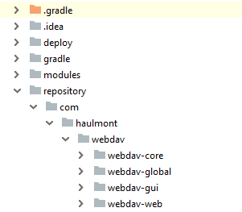
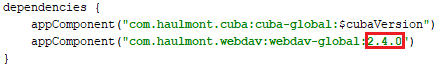
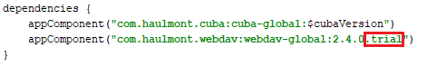

# WebDAV demo project

This is a demo project for the [CUBA WebDAV addon](https://www.cuba-platform.com/marketplace/webdav/).

## How to Include the WebDAV Trial Version 

You can get trial subscription from [CUBA marketplace](https://www.cuba-platform.com/marketplace/webdav/) to run this application on your local environment. After getting trial subscription you'll receive an email with a link for downloading ZIP archive with artifacts.

To install the trial version of WebDAV add-on:
1. Get trial subscription from [CUBA marketplace](https://www.cuba-platform.com/marketplace/webdav/). You'll get an email with a link and instructions.

2. Download ZIP archive with artifacts at link from the email.

3. Go to the user's home directory and create `.m2` folder if it doesn't exist. It is your local Maven repository. Default home directory for operating system:

  * Windows - <root>\Users\<username>
  * Linux - /home/\<username>
  * macOS - /Users/\<username>

4. Create folder `repository` in `.m2`.

5. Unzip the file with artifacts into this directory. You should get the following directory structure:

 
 
6. Clone the repository of this demo project.

7. Open demo project in CUBA Studio.

8. Open `build.gradle` file, find a string with add-on coordinates and replace the add-on version with the latest one. Check the latest version on [CUBA marketplace](https://www.cuba-platform.com/marketplace/webdav/).

 
 
9. Then add `.trial` to the end of add-on coordinates.

 
 
10. Go to *CUBA -> Build Tasks -> Deploy* to check that the add-on was installed successfully.